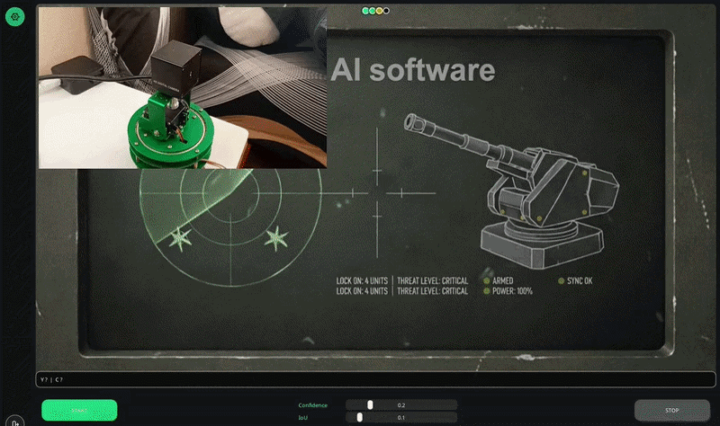
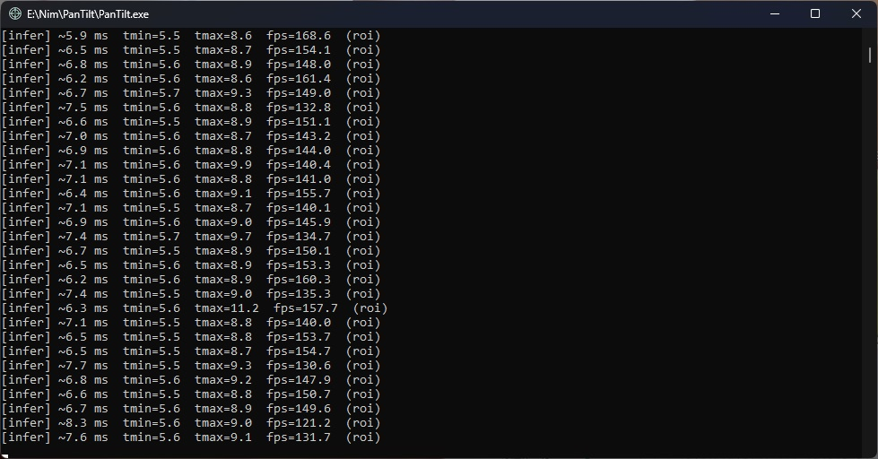
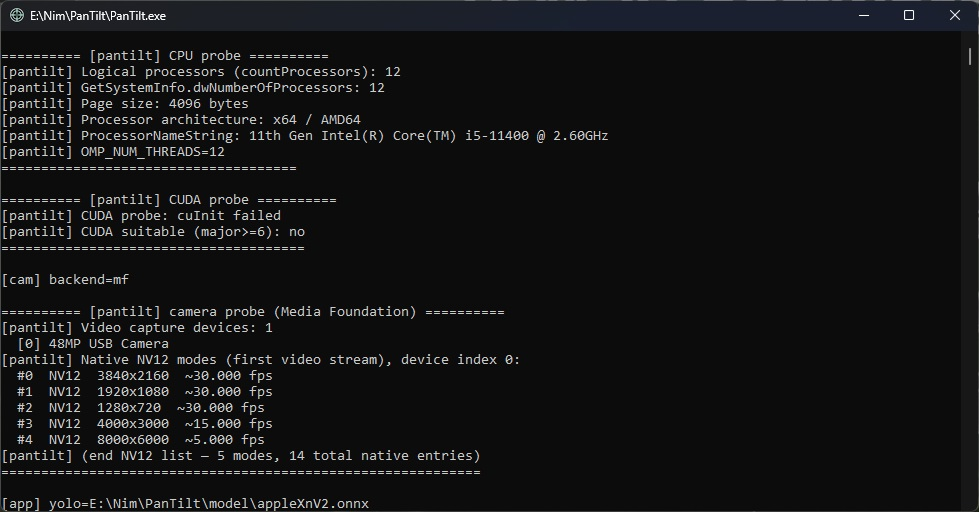
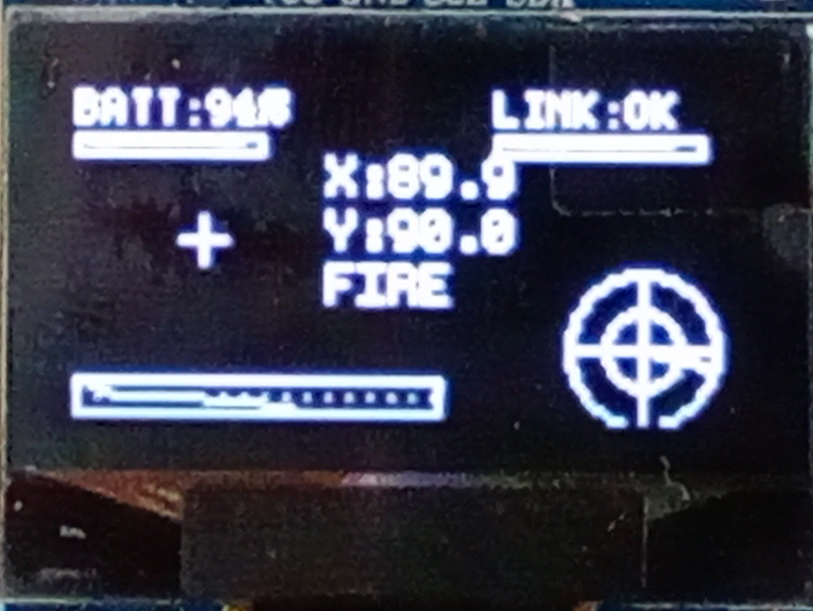
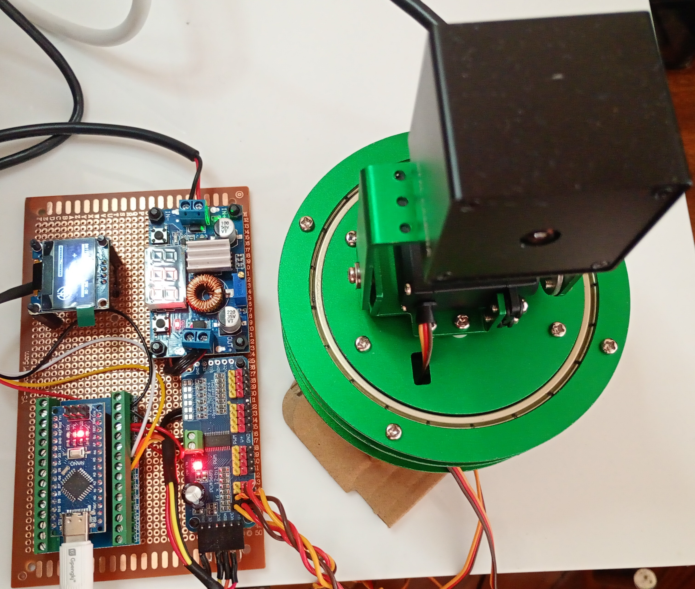
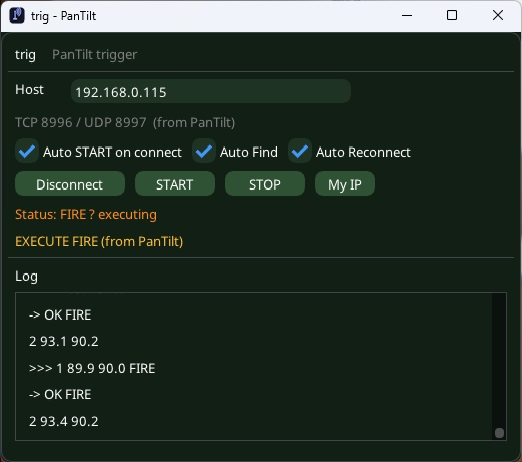

# PanTilt

build 0.9.0 · Windows x64 · Nim · ONNX Runtime + OpenVINO · Nano + PCA9685

Same GitHub repo as the old short tracker page. I reworked the software; the URL stayed.

I debug on apples. Not because the product is fruit - it’s an easy moving target on the desk. You can see timing, aim degrees, and how two objects sit in a journal. One is active (followed). The other is watch. If something new walks into frame while you already have a primary, it stays watch. I don’t jump to it just because the box is larger.

The neck UI looks a bit like a turret. That’s just the skin. Underneath it’s the same kind of loop as EdgeInfer (ImGui, Out/trig, ORT + OpenVINO on CPU), plus journal, servos, and optional OLED.

EdgeInfer: https://github.com/olesha-ai/edgeinfer-eval

Package: Releases - 0.9.0 / PanTiltV09  
https://github.com/olesha-ai/pan-tilt-ai-tracker/releases

---

## Pictures

<table>
  <tr>
    <td width="50%"></td>
    <td width="50%"></td>
  </tr>
</table>

My machine: i5-11400, OpenVINO CPU, cheap USB cam. ROI is a few ms, same order as EdgeInfer. Cam is about 30 fps. Neck PWM is 50 Hz on the Nano.

---

## Behaviour (desk)

Full frame finds up to two objects, then journal. ROI sticks to the active one. Neck aims at the same center you see as X/Y on the HUD (from turret home ticks, not from the live neck pose).

Active gone → promote watch. New object while active is still there → watch only.

Smoothing is on the PC. Nano just takes 3-byte packs and drives PCA9685 (OLED if you flashed pantilt2). No COM, or neck_com_port set to 0 → app still runs without the neck.

YOLOX on the desk, plus Cat for the apple verdict strip.

If you only want the vision eval build, use EdgeInfer. PanTilt doesn’t replace it.

---

## What’s in the zip

- PanTilt.exe
- trig.exe (LAN client, optional)
- lib/openvino/ - keep it
- model/ - the ONNX I used on the desk
- settings.json - read this before START
- licenses/ - leave it in the package
- Arduino sketches if packed (pantilt2 = OLED, plain bridge = no display)

### settings.json

Next to the exe. Values in the zip may be from my desk - change them.

neck_com_port - COM number of the Nano (Device Manager). Mine used to be 5; yours is different. Put your real port, or put 0 and run without the neck. The shipping zip should already have 0.

Also: camera_index, model / cat_model, conf / iou, ip_port (trig TCP; Find is usually port+1), neck_pan_center / neck_tilt_center (I use 307 / 325), memory_diag_enabled (leave false unless you want logs/).

Edit the file or open Settings (S when idle) and Apply.

---

## Hardware I actually wired

Nano at 115200 → PCA9685 at 50 Hz → two MG996R. Servos on their own ~6 V from a 12 V brick; common GND with the Nano. USB cam. Optional 128×64 OLED on the same I2C as the PCA.

Photo is the pair above (screen + board).

---

## Run

1. Unpack somewhere local.
2. Keep lib/openvino/ and model/ next to the exe.
3. Flash Nano if you have one.
4. Set neck_com_port (or leave 0).
5. Run PanTilt.exe from cmd if you want [infer] lines.
6. Lamps up → START or Space. STOP or Space. Esc asks before quit.

Keys like EdgeInfer: Space, S, Esc. After neck warmup, give START a second before you hit STOP.

---

## License

Testing, teaching, research, feedback - yes.  
Commercial production under this license - no.  
See LICENSE.md. Third-party files (OpenVINO, ORT, YOLOX, and so on) are in licenses/. Keep that folder with the zip.

Need a commercial deal - write me. I’m not a lawyer; this matches how I ship the EdgeInfer eval package.

Intel, OpenVINO, Microsoft, Megvii and other names are their trademarks. No affiliation.

---

Old README here was the early detect → center → follow note. This page is 0.9.0.

olesha-ai

